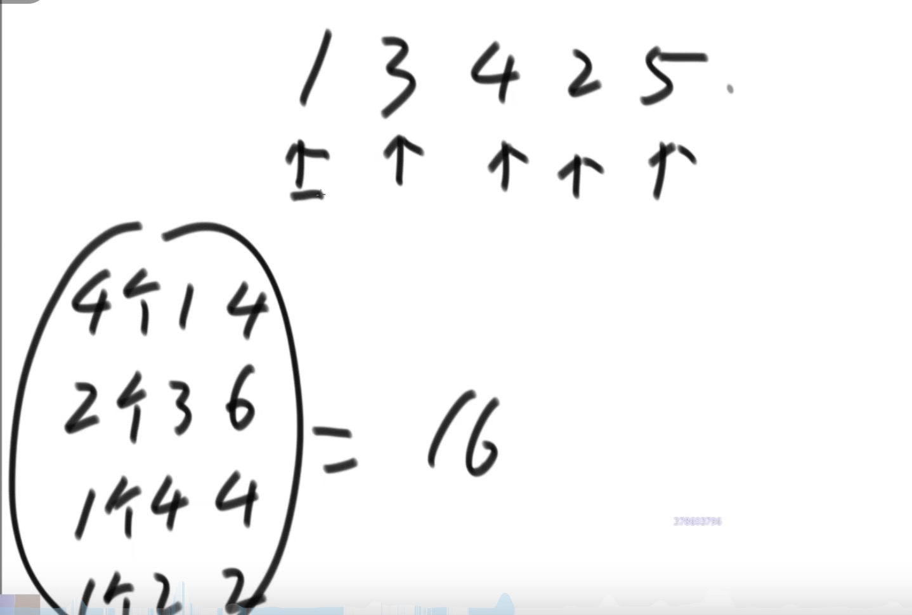

## 小和问题
> 数组中一个数左边比他小的数的总和，数组中所有值的和求和
思路：反向思维，一个数右边有多个数比他大

```js
function smallSum(arr) {
  if (arr.length < 2) {
    return 0
  }

  return process(arr, 0, arr.length - 1)
}

function process(arr, l, r) {
  if (l === r) {
    return 0
  }

  const mid = l + ((r - l) >> 1)

  return process(arr, l, mid) + process(arr, mid + 1, r) + merge(arr, l, mid, r)
}

// 排序 + 求和
function merge(arr, l, m, r) {
  const help = new Array(r - l + 1)
  let i = 0
  let p1 = l
  let p2 = m + 1
  let res = 0

  while (p1 <= m && p2 <= r) {
    res += arr[p1] < arr[p2] ? (r - p2 + 1) * arr[p1] : 0
    help[i++] = arr[p1] < arr[p2] ? arr[p1++] : arr[p2++]
  }

  while (p1 <= m) {
    help[i++] = arr[p1++]
  }

  while (p2 <= r) {
    help[i++] = arr[p2++]
  }

  for (i = 0; i <= help.length; i++) {
    arr[l + i] = help[i]
  }

  return res
}
```


